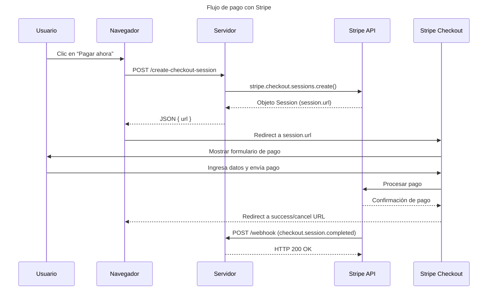

# Taller de Stripe para Web Reactiva


> [!IMPORTANT]  
> Aprende a utilizar Stripe para integrar el pago online en tus aplicaciones


## Modo de empleo

> Debes tener una cuenta de Stripe para poder generar las claves API y un producto de prueba para tener un `price_id`.
> Lo hacemos todo con dinero "de mentira"

1. Descarga el repositorio y ejecuta `npm install`
2. El repositorio es un monorepo con 4 proyectos hijos. Cada uno tiene su propia configuración en el fichero `.env.example` que debes clonar.
_(En algunos hemos "hardcodeado" las claves dentro del código, sorry)_
4. Puedes ejecutar cada proyecto con estos comandos desde la raíz

````
npm run start:hosted-page
npm run start:embedded-form
npm run start:elements-form
npm run start:subscription-example
````

## Qué hace cada proyecto

Los encontrarás de forma individual en cada una de las carpetas de `apps` 

### hosted-page

Es el ejemplo más sencillo de la doc de Stripe

### embedded-form

Una compra sencilla pero con el checkout embebido dentro de tu sitio

### elements-form

Usando el modo más complejo de integración con Stripe Elements

### subscription-example

Particularidades de la compra de suscripciones y el Customer portal

## Cómo funciona stripe





> [!TIP]  
> Gracias a la comunidad malandriner por su apoyo


